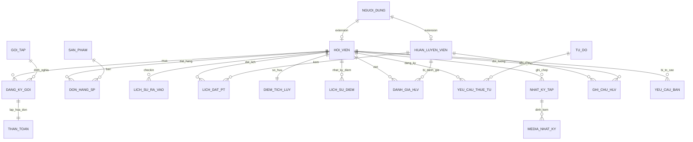

# 📊 Sơ đồ Thực thể Mối quan hệ (ERD) - Monkey Gym v2.0

Dưới đây là thiết kế cơ sở dữ liệu toàn diện cho hệ thống Monkey Gym, bao gồm 20 bảng được liên kết chặt chẽ để phục vụ các luồng nghiệp vụ từ quản lý hội viên, thanh toán đến tích điểm và tương tác.

---

## 🏗️ Sơ đồ ERD (Entity Relationship Diagram)

---

## 📄 Chi tiết các nhóm bảng

### 1. Hệ thống Tài khoản & Định danh
- **`NGUOI_DUNG`**: Bảng gốc lưu thông tin đăng nhập. Phân quyền qua cột `vai_tro` (admin, nhanvien, hlv, hoi_vien).
- **`HOI_VIEN`**: Mở rộng từ `NGUOI_DUNG`. Lưu mã QR cá nhân, chỉ số BMI và trạng thái khóa tài khoản (`bi_ban`).
- **`HUAN_LUYEN_VIEN`**: Mở rộng từ `NGUOI_DUNG`. Lưu hồ sơ chuyên môn, ảnh đại diện và giới thiệu công khai.

### 2. Quản lý Gói tập & Tài chính
- **`GOI_TAP`**: Danh mục các gói Gym hoặc gói có PT kèm.
- **`DANG_KY_GOI`**: Bảng trung gian lưu vết hội viên đang sử dụng gói nào, ngày hết hạn.
- **`THANH_TOAN`**: Lưu chi tiết giao dịch từ VNPay hoặc tiền mặt. Liên kết 1-1 với đơn đăng ký gói.

### 3. Cửa hàng & Tích điểm (Gamification)
- **`SAN_PHAM`**: Đồ tập, thực phẩm chức năng. Có cột `gia_diem` phục vụ tính năng đổi quà.
- **`DIEM_TICH_LUY`**: Lưu số dư điểm hiện tại của hội viên. Tự động cộng điểm dựa trên Check-in QR.
- **`LICH_SU_DIEM`**: Nhật ký biến động điểm (Cộng điểm chuyên cần, trừ điểm đổi quà).

### 4. Vận hành & Tương tác
- **`TU_DO` & `YEU_CAU_THUE_TU`**: Hệ thống quản lý tủ đồ. Hội viên gửi yêu cầu -> Staff duyệt và gán số tủ cụ thể.
- **`DAN_GIA_HLV`**: Hội viên đánh giá PT. Có cơ chế kiểm duyệt (`pending` -> `approved`) để Admin quản lý chất lượng.
- **`NHAT_KY_TAP`**: Lưu hành trình tập luyện. Một bài đăng có thể đính kèm nhiều ảnh/video thông qua bảng `MEDIA_NHAT_KY`.
- **`GHI_CHU_HLV`**: Chỉ HLV mới có quyền viết ghi chú về sức khỏe/tiến độ của học viên mình đang kèm.

### 5. Quản trị & Staff
- **`THONG_BAO_HE_THONG`**: Các thông báo được hiển thị nổi bật trên giao diện người dùng.
- **`YEU_CAU_BAN`**: Cơ chế Staff báo cáo vi phạm giúp Admin xem xét khóa tài khoản hội viên.

---

> [!NOTE]
> Tất cả các bảng quan trọng như `HOI_VIEN`, `HUAN_LUYEN_VIEN` đều sử dụng `ON DELETE CASCADE` liên kết với `NGUOI_DUNG` để đảm bảo tính nhất quán dữ liệu khi xóa tài khoản.
